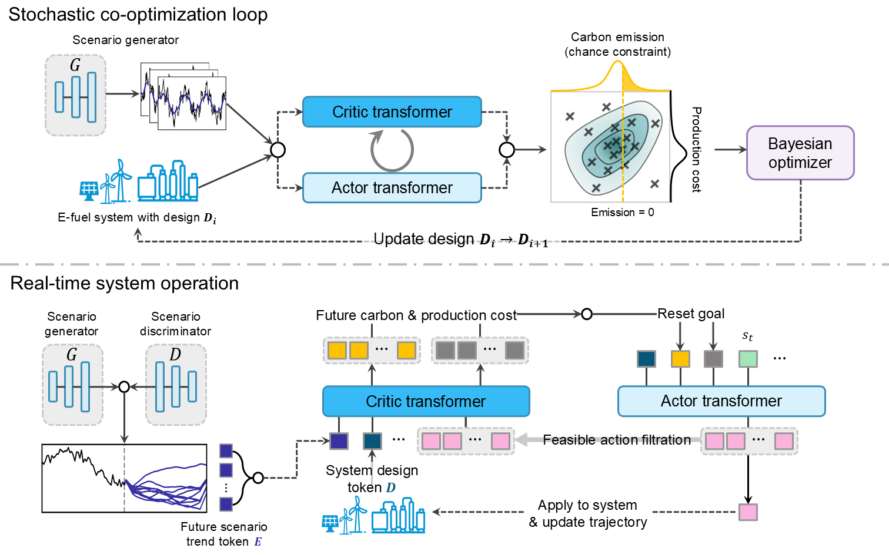

# MasCOR
We present **MasCOR**, a machine-learning-assisted co-optimization framework that learns from optimal trajectories generated by mathematical programming solvers. MasCOR enables rapid screening of feasible design spaces together with dynamic operational policies of renewable power systems under region-specific renewable generation patterns.

---
## 1. Motivation

E-fuel systems (e.g., power-to-methanol) require joint optimization of:
- **System design** (ESS sizing, production capacity)  
- **Operational strategy** (hourly dispatch under renewable variability)

Under region-specific renewable temporal patterns, design choices such as battery storage, hydrogen storage, and grid backup directly impact both **cost** and **carbon emissions**. Thus, design and operation must be co-optimized under region-specific renewable uncertainty.

### Limitations of Existing Approaches

Current stochastic co-optimization methods face three core limitations:

**1. Oversimplified Renewable Uncertainty**  
Most models rely on empirical or probabilistic distributions, ignoring temporal correlations and realistic renewable patterns of target sites.

**2. Deterministic Second-Stage Operation**  
Operational optimization based on conventional linear programming (LP) assumes full-horizon information, limiting its applicability to real-time decision-making. Although second-stage recourse can be solved over a scenario set, the resulting global LP solution cannot provide adaptive, sequential operational guidance for hourly decisions of real-time system operation.

**3. Computational Bottleneck**  
Uncertainty quantification of a fixed system design requires repeatedly solving large-scale second-stage optimization problems, leading to significant computational burden and limited scalability.

MasCOR addresses these limitations through a co-optimization framework combining a scenario-generative machine learning model and an RL agent trained on optimal trajectories.

---
## 2. Methodology

  

