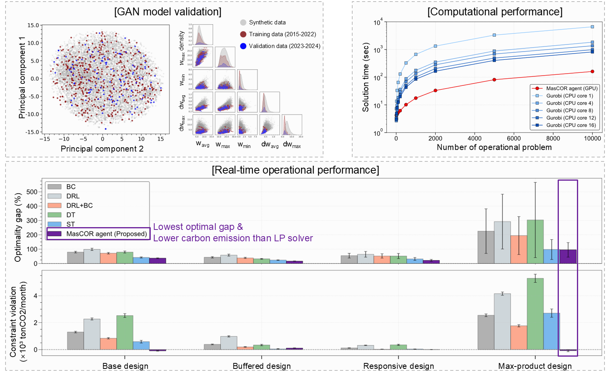

# MasCOR
We present **MasCOR**, a machine-learning-assisted co-optimization framework that learns from optimal trajectories generated by mathematical programming solvers. MasCOR enables rapid screening of feasible design spaces together with dynamic operational policies of renewable power systems under region-specific renewable generation patterns.

---
## 1. Motivation

E-fuel systems (e.g., power-to-methanol) require joint optimization of:
- **System design** (ESS sizing, production capacity)  
- **Operational strategy** (hourly dispatch under renewable variability)

Under region-specific renewable temporal patterns, design choices such as battery storage, hydrogen storage, and grid backup directly impact both **cost** and **carbon emissions**. Thus, design and operation must be co-optimized under region-specific renewable uncertainty.

### Limitations of Existing Approaches

Current stochastic co-optimization methods face three core limitations:

**1. Oversimplified Renewable Uncertainty**  
Most models rely on empirical or probabilistic distributions, ignoring temporal correlations and realistic renewable patterns of target sites.

**2. Deterministic Second-Stage Operation**  
Operational optimization based on conventional linear programming (LP) assumes full-horizon information, limiting its applicability to real-time decision-making. Although second-stage recourse can be solved over a scenario set, the resulting global LP solution cannot provide adaptive, sequential operational guidance for hourly decisions of real-time system operation.

**3. Computational Bottleneck**  
Uncertainty quantification of a fixed system design requires repeatedly solving large-scale second-stage optimization problems, leading to significant computational burden and limited scalability.

MasCOR addresses these limitations through a co-optimization framework combining a scenario-generative machine learning model and an RL agent trained on optimal trajectories.

---
## 2. Methodology
<p align="center">
  
</p>

1. **Stochastic Co-Optimization Loop**

   Given a target site, co-optimization determines optimal system design variables (e.g., ESS sizing, production capacity) together with dynamic operational policies. Under renewable uncertainty, chance constraints on carbon emissions (Prob(emission > 0) < criteria) are enforced. The ML-assisted loop proceeds as follows:

   1. **Renewable Scenario Generation**  
      A pre-trained GAN generates synthetic monthly renewable scenarios.

   2. **Dynamic Operational Planning**  
      For a given design and scenario set, a transformer-based actor-critic agent solves the second-stage operation as a dynamic planning task in parallel.

   3. **Design Update via Bayesian Optimization**  
      Performance metrics (cost and emissions) are aggregated and fed into a multi-objective Bayesian optimization routine to update the system design.

   The process iterates until convergence.

2. **Real-Time System Operation**

    After co-optimization, **MasCOR** supports adaptive real-time operation using only hourly renewable power and grid price information, without additional model modification or online training.

    MasCOR employ goal-conditioning sqeential modeling approach using two tokens:

    - **RTG (Return-to-Go)**: expected future system operational profit  
    - **CTG (Carbon-to-Go)**: expected future carbon emission  

    At each time step:

    1. **Future Scenario Forecasting**  
      A renewable trend token _E_ is derived from GAN-generated future renewable scenarios.

    2. **Goal-conditiong action inference**  
       The actor predicts the next action candidate conditioned on system design token _D_, historical trajectory, and current goals (RTG, CTG).
       
    3. **Screening action & operation**  
        The critic infer RTG and CTG of each action candidate conditioned on _D_, _E_, and historical trajectory. 
        Screen out infeasible action (CTG>0) and idenfity optimal action with maximum RTG.
       
    The selected action is applied to the system, and the realized profit and emission are used to update RTG and CTG for the next step.
    This sequential goal-conditioning enables adaptive real-time dynamic planning under renewable uncertainty.

---
## 3. Code description
### Setup
```bash
# Build the Docker image:
docker build -t mascor:latest .
```
Since the MasCOR agent is trained on optimal trajectories generated by mathematical programming, a valid **Gurobi Optimizer license** is required.

Please obtain a Gurobi license and place the license file (`gurobi.lic`) in the project root directory before image build.

### Repository Structure

- **mascor/dataset-construction/**  
  - `renewable_loading.py` : Load historical renewable datasets based on target region longitude and latitude.  
  - `trajectory_generation.py` : Generate optimal trajectories via mathematical programming for training dataset construction.

- **mascor/train/**  
  - `train_gan.py` : Train the GAN-based renewable scenario generator.  
  - `train_agent.py` : Train the transformer-based actor-critic agent.

- **mascor/optimization/**  
  - `rbdo_problem.py` : Chance-constrained stochastic co-optimization problem formulation.  
  - `uq_problem.py` : Uncertainty quantification of system performance under fixed design.

- **test/**  
  - `benchmark/` : Performance and computational efficiency comparison of MasCOR against behavior cloning, DRL, decision transformer, and LP solver.  
  - `gan-evaluation/` : Validation and evaluation of GAN-generated renewable scenarios.  
  - `optimization/` : Execution scripts for co-optimization, uncertainty quantification, and real-time operation.

### Example results
<p align="center">
  
</p>


